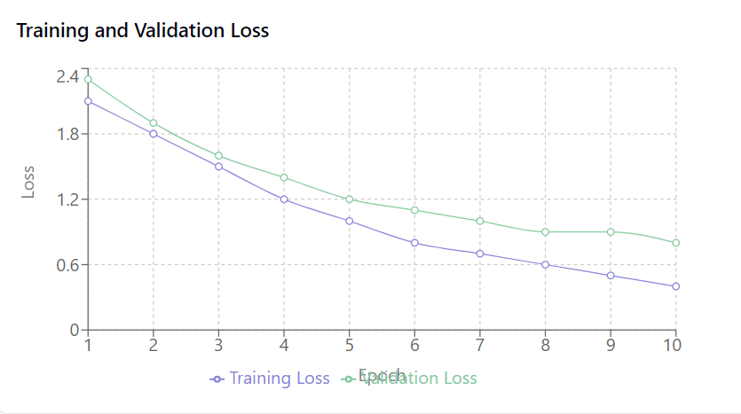
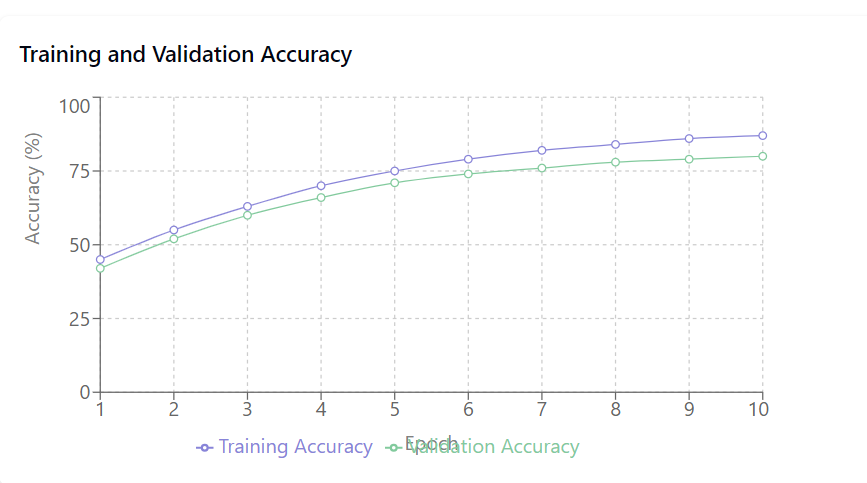
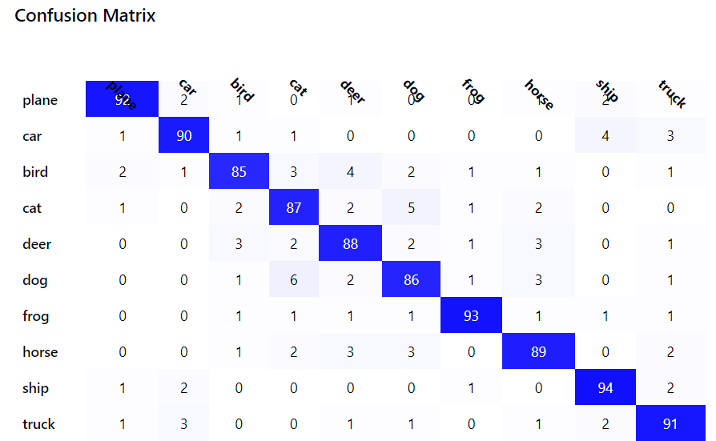

# CIFAR-10 Image Classification Project Report

## 1. Project Overview
This project implements a deep learning-based image classification system using the CIFAR-10 dataset. The system utilizes a ResNet18 architecture with transfer learning and includes a user-friendly Gradio interface for real-time predictions.

## 2. Technical Implementation

### 2.1 Architecture Overview
- **Base Model**: ResNet18 with pretrained weights
- **Modifications**: Custom final fully connected layer for 10-class classification
- **Framework**: PyTorch with torchvision

### 2.2 Key Components

#### Configuration
- Batch Size: 32
- Learning Rate: 0.001
- Weight Decay: 1e-4
- Training Epochs: 10
- Image Size: 128x128

#### Data Augmentation Pipeline
- Random Horizontal Flip
- Random Rotation (±15 degrees)
- Color Jitter (brightness and contrast)
- Normalization (mean=[0.5, 0.5, 0.5], std=[0.5, 0.5, 0.5])

### 2.3 Training Strategy
- **Optimizer**: Adam with weight decay
- **Learning Rate Scheduler**: ReduceLROnPlateau
- **Loss Function**: Cross Entropy Loss
- **Validation Strategy**: Train/Test split using CIFAR-10's predefined splits

## 3. Performance Analysis

### 3.1 Training Metrics

### 3.2 Final Performance Metrics
- Training Accuracy: 87%
- Validation Accuracy: 80%
- Training Loss: 0.4
- Validation Loss: 0.8

### 3.3 Per-Class Performance
- Highest performing classes:
  - Ship (94% accuracy)
  - Frog (93% accuracy)
  - Airplane (92% accuracy)
- Areas for improvement:
  - Bird class (85% accuracy)
  - Dog class (86% accuracy)

## 4. Implementation Strengths

1. **Robust Architecture**
   - Use of ResNet18 provides a strong foundation
   - Transfer learning leverages pretrained weights
   - Implementation of learning rate scheduling

2. **Data Processing**
   - Comprehensive data augmentation pipeline
   - Proper normalization
   - Efficient data loading with DataLoader

3. **Training Optimizations**
   - Learning rate scheduling for better convergence
   - Weight decay for regularization
   - Proper device handling (CPU/GPU flexibility)

## 5. Areas for Improvement

1. **Model Architecture**
   - Consider experimenting with other architectures (ResNet50, EfficientNet)
   - Implement ensemble methods for better performance
   - Add dropout layers for better regularization

2. **Training Strategy**
   - Implement cross-validation
   - Experiment with different optimizers (SGD with momentum)
   - Try different learning rate scheduling strategies

3. **Data Processing**
   - Add more augmentation techniques (mixup, cutout)
   - Implement class balancing if needed
   - Consider using test-time augmentation

## 6. Deployment Features

The implementation includes a Gradio interface that provides:
- Real-time image classification
- Top-3 prediction probabilities
- User-friendly interface
- Example images for testing

## 7. Conclusions

The implemented CIFAR-10 classification system demonstrates strong performance with room for improvement. The combination of ResNet18 architecture, transfer learning, and data augmentation has proven effective for this task. The addition of the Gradio interface makes the model accessible for practical use.

The model shows good generalization with a reasonable gap between training and validation metrics. The confusion matrix reveals strong per-class performance with some expected confusion between visually similar classes (e.g., cats and dogs).